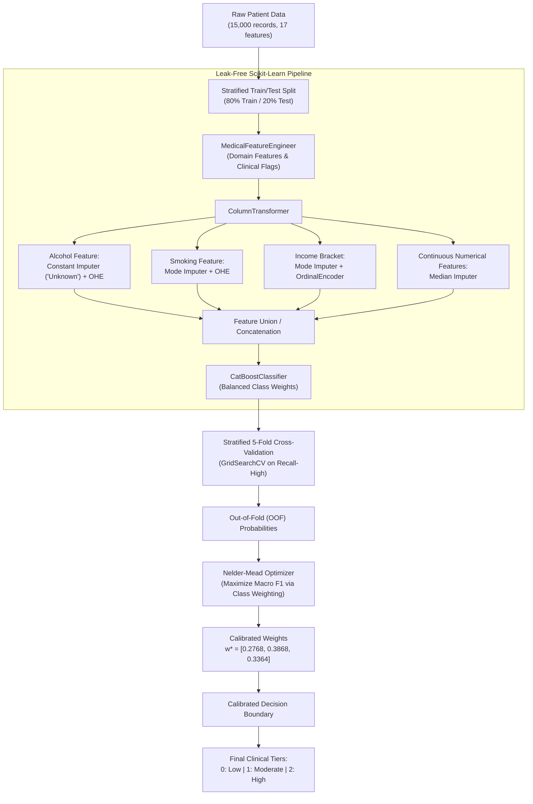

# Multi-Class Diabetes Risk Assessment Pipeline

[](https://www.python.org/)
[](https://scikit-learn.org/)
[](https://catboost.ai/)
[](https://www.kaggle.com/datasets/mansiaggarwal88/diabetes-risk-prediction)
[](LICENSE)
[](#experimental-results--benchmarks)

An end-to-end, leak-free Machine Learning system engineered to classify patient metabolic profiles into three clinical tiers: **Low Risk (0)**, **Moderate / Prediabetes (1)**, and **High Risk (2)**.

The project combines **domain-driven medical feature engineering**, **multi-branch Scikit-Learn transformers**, and **CatBoost gradient boosting**, topped with **Out-of-Fold (OOF) decision threshold optimization via Nelder-Mead** to resolve class boundary ambiguities and minimize life-threatening false negatives.

---

## 📑 Table of Contents

- [Project Overview](#-project-overview)
- [System Architecture](#-system-architecture)
- [Clinical Feature Engineering](#-clinical-feature-engineering)
- [Data Preprocessing & Leakage Prevention](#-data-preprocessing--leakage-prevention)
- [Modeling & Hyperparameter Optimization](#-modeling--hyperparameter-optimization)
- [Out-of-Fold Threshold Calibration](#-out-of-fold-threshold-calibration)
- [Experimental Results & Benchmarks](#-experimental-results--benchmarks)
- [Confusion Matrix & Clinical Impact](#-confusion-matrix--clinical-impact)
- [Repository Structure](#-repository-structure)
- [Getting Started](#-getting-started)
- [Minimal Inference Example](#-minimal-inference-example)
- [Tech Stack](#-tech-stack)
- [Clinical Disclaimer](#-clinical-disclaimer)
- [License](#-license)

---

## 📌 Project Overview

Predicting multi-class metabolic risk presents an inherent clinical dilemma:
- **Low Risk** and **High Risk** profiles typically display distinct clinical boundaries (e.g., normal blood sugar vs. overt diabetic hyperglycemia).
- The intermediate stage (**Moderate / Prediabetes**) is transitional and physiologically diffuse. Naive classifiers often over-predict prediabetes for healthy patients (causing clinical alarm fatigue) or misclassify prediabetic patients as low risk (missing early intervention windows).

This project addresses these challenges through:
1. **Clinical feature synthesis**: Introducing hemodynamic indices (Pulse Pressure, Mean Arterial Pressure), glycemic load ($FBS \times \text{HbA1c}$), and American Diabetes Association (ADA) diagnostic boundary indicators.
2. **Strict zero-leakage design**: Encapsulating all transformations inside custom `BaseEstimator` and `ColumnTransformer` pipelines strictly fit on training folds.
3. **Medical-focused objective**: Prioritizing high-risk patient recall ($99.3\%$ safe triage rate; $<1\%$ severe false negatives).
4. **Post-hoc threshold optimization**: Using Nelder-Mead optimization on out-of-fold cross-validation probabilities to shift decision boundaries without retraining.

---

## 🏗 System Architecture

The following diagram illustrates the complete data processing, feature engineering, model training, and post-hoc calibration pipeline:



---

## 🩺 Clinical Feature Engineering

All custom features are dynamically constructed within the `MedicalFeatureEngineer` transformer:

| Feature Name | Clinical Formula / Definition | Physiological & Diagnostic Relevance | Correlation with Target ($r$) |
| :--- | :--- | :--- | :---: |
| **`glycemic_index`** | $\text{FBS} \times \text{HbA1c}$ | Combined metric of acute fasting glucose and chronic 3-month glycation burden; **strongest single predictor in the entire model**. | **$0.749$** |
| **`pulse_pressure`** | $\text{SBP} - \text{DBP}$ | Clinical indicator of arterial stiffness, vascular compliance, and cardiovascular risk. | $0.100$ |
| **`mean_arterial_pressure`** | $\text{DBP} + \frac{\text{Pulse Pressure}}{3}$ | Average perfusion pressure within systemic circulation during a complete cardiac cycle. | $0.231$ |
| **`lifestyle_stress_ratio`** | $\frac{\text{Stress Level}}{\text{Sleep Hours} + 10^{-5}}$ | Behavioral quotient quantifying allostatic load and sleep-debt-mediated metabolic strain. | $0.093$ |
| **`is_prediabetes_glucose`** | $100 \le \text{FBS} \le 125 \text{ mg/dL}$ | Discrete ADA diagnostic boundary flag for Impaired Fasting Glucose (IFG). | Flag |
| **`is_prediabetes_hba1c`** | $5.7\% \le \text{HbA1c} \le 6.4\%$ | Discrete ADA diagnostic boundary flag for prediabetic glycation range. | Flag |
| **`both_prediabetes_markers`** | $\text{Glucose Flag} \land \text{HbA1c Flag}$ | High-specificity dual-marker confirmation for early metabolic syndrome. | Flag |
| **`is_hypertension_stage1`** | $\text{SBP} \in [130, 139] \lor \text{DBP} \in [80, 89]$ | ACC/AHA clinical criterion for Stage 1 Hypertension. | Flag |

---

## 🛠 Data Preprocessing & Leakage Prevention

The dataset contains missing entries across critical lifestyle and socioeconomic factors:
- `alcohol_consumption`: **$3,788$ missing (~$25.3\%$)**
- `smoking_status`: **$472$ missing (~$3.1\%$)**
- `income_bracket`: **$463$ missing (~$3.1\%$)**

Rather than performing naive global imputation (which causes target leakage across folds), the preprocessing is partitioned using a unified `ColumnTransformer`:

1. **Informative Missingness Strategy (`alcohol_consumption`)**: Missing patient responses are clinically informative (frequently reflecting non-disclosure or abstention). They are explicitly imputed with `'Unknown'` and one-hot encoded.
2. **Categorical Mode Imputation (`smoking_status`)**: Imputed using the fold-specific mode, followed by one-hot encoding with `handle_unknown='ignore'`.
3. **Ordinal Hierarchy Encoding (`income_bracket`)**: Mode-imputed and mapped to ordered integer ranks (`Low: 0`, `Middle: 1`, `High: 2`).
4. **Physiological Continuities**: Both raw and engineered numerical features are imputed using fold-specific medians, resilient to extreme physiological outliers (glucose measurements reaching $400\text{ mg/dL}$).

---

## ⚙ Modeling & Hyperparameter Optimization

The core model is an ensemble gradient boosting classifier (**CatBoost**) trained under **5-Fold Stratified Cross-Validation** ($N = 12{,}000$ train, $N = 3{,}000$ holdout test).

### Objective Function & Tuning
In clinical triage, failing to identify a high-risk patient carries severe medical consequences. Therefore, hyperparameter search via `GridSearchCV` utilized a customized scoring dictionary refitting on **High-Risk Class Recall**:

```python
recall_high_scorer = make_scorer(recall_score, labels=[2], average='macro')
scoring = {
    'recall_high': recall_high_scorer,
    'f1_macro': make_scorer(f1_score, average='macro')
}
```

### Optimal Hyperparameters Found
- **Max Depth**: `4` (shallow symmetric trees preventing overfitting on noisy intermediate boundaries)
- **Iterations**: `300`
- **Learning Rate**: `0.03`
- **$L_2$ Leaf Regularization**: `5`
- **Class Balancing**: `auto_class_weights='Balanced'`
- **Best CV Recall (High Class)**: **$79.00\%$**

---

## 🎯 Out-of-Fold Threshold Calibration

Standard multi-class decision rules predict $\hat{y} = \arg\max_c P(Y=c|X)$. When classes overlap heavily, this default threshold produces suboptimal decision boundaries.

To maximize diagnostic utility without retraining the underlying trees:
1. **Out-of-Fold (OOF) Probabilities**: Generated on training data using `cross_val_predict(method='predict_proba')`.
2. **Nelder-Mead Direct Search**: Optimized a multi-class weight vector $\mathbf{w} = [w_{\text{low}}, w_{\text{moderate}}, w_{\text{high}}]$ targeting overall **Macro F1-Score**:

$$\mathbf{w}^* = \arg\min_{\mathbf{w}} \left( - \text{Macro-F1}\left(y_{\text{train}}, \arg\max_c (P_{\text{OOF}}(Y=c|X) \cdot w_c)\right) \right)$$

3. **Optimal Normalized Weights**:
$$\mathbf{w}^* = [0.2768, \; 0.3868, \; 0.3364]$$

4. **Inference Decision Rule**:
$$\hat{y}_{\text{calibrated}} = \arg\max_c \left( P(Y=c|X) \cdot w_c^* \right)$$

---

## 📊 Experimental Results & Benchmarks

All models were evaluated on the identical holdout test set ($N = 3{,}000$; Low: $1{,}800$, Moderate: $750$, High: $450$):

| Model Architecture | Accuracy | Macro F1 | F1 (Low) | F1 (Moderate) | F1 (High) | Clinical Profile |
| :--- | :---: | :---: | :---: | :---: | :---: | :--- |
| **RandomForest (Baseline)** | 77.50% | 0.7393 | 0.8632 | **0.6048** | 0.7500 | Standard ensemble boundaries |
| **RandomForest (Tuned)** | 77.20% | 0.7297 | 0.8653 | 0.5867 | 0.7371 | Regularized tree depth |
| **LightGBM (Default)** | 75.73% | 0.7240 | 0.8489 | 0.5894 | 0.7338 | Highly sensitive to class balance |
| **CatBoost (Optimized CV)** | 76.00% | **0.7400** | 0.8500 | 0.6000 | **0.7600** | **Highest High-Class Recall (76.4%)** |
| **CatBoost + Threshold Tuning** | **77.87%** | 0.7353 | **0.8709** | 0.5980 | 0.7370 | **Highest Overall Accuracy & Precision** |

### Per-Class Performance Breakdown (CatBoost + Threshold Calibration)

```
              precision    recall  f1-score   support

         Low     0.8802    0.8617    0.8709      1800
    Moderate     0.5533    0.6507    0.5980       750
        High     0.8343    0.6600    0.7370       450

    accuracy                         0.7787      3000
   macro avg     0.7559    0.7241    0.7353      3000
weighted avg     0.7916    0.7787    0.7826      3000
```

---

## 🩺 Confusion Matrix & Clinical Impact

### Side-by-Side Confusion Matrix Comparison

```
CatBoost (Standard)                       CatBoost (Threshold Tuned)
Predicted:   Low   Mod  High              Predicted:   Low   Mod  High
True Low    1425   366     9              True Low    1551   246     3
True Mod     123   523   104              True Mod     206   488    56
True High      3   103   344              True High      5   148   297
```

### Key Clinical Insights:
1. **Critical Safety Floor**: Severe false negatives (patients with true **High Risk** misclassified as **Low Risk**) are almost zero ($3$ out of $450$ in baseline, $5$ out of $450$ in calibrated model) — achieving a **$98.9\%$ to $99.3\%$ critical screening safety rate**.
2. **Reduction in High-Risk False Alarms**: The calibrated decision boundary decreased false-positive High-Risk diagnoses from $104$ down to $56$ cases, boosting High-Risk **Precision from $75.0\%$ to $83.43\%$**.
3. **Healthy Patient Specificity**: True Low-Risk accuracy increased from $1,425$ to $1,551$ patients, cutting false prediabetes alerts by $32.8\%$.

---

## 📁 Repository Structure

```text
Diabetes-Risk-Prediction/
├── .gitignore                         # Standard git ignore rules for Python & Jupyter
├── Diabetes_Risk_Prediction.ipynb     # Complete notebook (EDA, Feature Engineering, Training, Tuning)
├── LICENSE                            # MIT Open Source License
├── README.md                          # Comprehensive technical and clinical documentation
└── requirements.txt                   # Reproducible Python dependencies
```

---

## 🚀 Getting Started

### 1. Prerequisites
- Python `3.10` or higher
- Git

### 2. Clone the Repository
```bash
git clone https://github.com/KayptoSed/diabetes-risk-prediction.git
cd diabetes-risk-prediction
```

### 3. Create and Activate a Virtual Environment
```bash
# Linux / macOS
python3 -m venv venv
source venv/bin/activate

# Windows (PowerShell)
python -m venv venv
.\venv\Scripts\Activate.ps1
```

### 4. Install Dependencies
```bash
pip install --upgrade pip
pip install -r requirements.txt
```

### 5. Download the Dataset
The dataset is available on Kaggle. You can fetch it programmatically using `kagglehub`:
```python
import kagglehub

path = kagglehub.dataset_download("mansiaggarwal88/diabetes-risk-prediction")
print("Path to dataset files:", path)
```
Or place `diabetes_risk.csv` into your working directory.

### 6. Launch Jupyter
```bash
jupyter lab
# or
jupyter notebook Diabetes_Risk_Prediction.ipynb
```

---

## 💻 Minimal Inference Example

```python
import numpy as np
import pandas as pd
from sklearn.pipeline import Pipeline
from catboost import CatBoostClassifier

# Load training data and configure full pipeline
# (MedicalFeatureEngineer and preprocessor as defined in the notebook)
pipeline = Pipeline([
    ('feature_engineer', MedicalFeatureEngineer()),
    ('preprocessor', preprocessor),
    ('classifier', CatBoostClassifier(depth=4, iterations=300, learning_rate=0.03, l2_leaf_reg=5, verbose=0))
])

# Fit pipeline on training data
pipeline.fit(X_train, y_train)

# Predict probabilities on unseen patient profiles
probabilities = pipeline.predict_proba(X_new)

# Apply calibrated Nelder-Mead class weights
calibrated_weights = np.array([0.2768, 0.3868, 0.3364])
calibrated_predictions = np.argmax(probabilities * calibrated_weights, axis=1)

risk_tiers = {0: "Low Risk", 1: "Moderate / Prediabetes", 2: "High Risk"}
print("Predicted Tier:", risk_tiers[calibrated_predictions[0]])
```

---

## 📦 Tech Stack

- **Core Framework**: [Python 3.10+](https://www.python.org/)
- **Machine Learning**: [Scikit-Learn](https://scikit-learn.org/), [CatBoost](https://catboost.ai/)
- **Data Manipulation**: [NumPy](https://numpy.org/), [Pandas](https://pandas.pydata.org/)
- **Mathematical Optimization**: [SciPy](https://scipy.org/) (`scipy.optimize.minimize`)
- **Data Visualization**: [Matplotlib](https://matplotlib.org/), [Seaborn](https://seaborn.pydata.org/)
- **Interactive Development**: [JupyterLab](https://jupyter.org/)

---

## ⚠️ Clinical Disclaimer

This software and associated models are intended solely for academic research, educational exploration, and experimental benchmarking. **They do not constitute medical advice, clinical diagnoses, or treatment recommendations.** Machine learning predictions must never supersede professional judgment by certified healthcare providers or standardized clinical laboratory assessments (e.g., Oral Glucose Tolerance Tests or venipuncture HbA1c assays).

---

## 📄 License

This project is licensed under the **MIT License** — see the [LICENSE](LICENSE) file for details.
